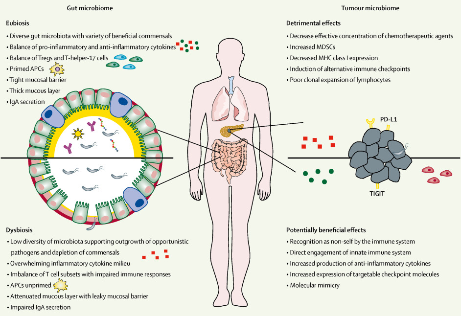

# Modulating the microbiome to improve therapeutic response in cancer

<!--
	Photon by HTML5 UP
	html5up.net | @ajlkn
	Free for personal and commercial use under the CCA 3.0 license (html5up.net/license)
-->

<html lang="en">
  <head>
    <meta charset="utf-8">
    <meta name="viewport" content="width=device-width, initial-scale=1.0">
    <meta name="description" content="">
    <meta name="author" content="">
    <link rel="shortcut icon" href="assets/ico/favicon.png">

    <title>MINIMAL - Free Bootstrap 3 Theme</title>

    <!-- Bootstrap core CSS -->
    <link href="assets/css/bootstrap.css" rel="stylesheet">

    <!-- Custom styles for this template -->
    <link href="assets/css/main.css" rel="stylesheet">
	<link rel="stylesheet" href="assets/css/font-awesome.min.css">

    
	
	

	
    <link href='http://fonts.googleapis.com/css?family=Oswald:400,300,700' rel='stylesheet' type='text/css'>
    <link href='http://fonts.googleapis.com/css?family=EB+Garamond' rel='stylesheet' type='text/css'>

    <!-- HTML5 shim and Respond.js IE8 support of HTML5 elements and media queries -->
    <!--[if lt IE 9]>
      
      
    <![endif]-->
  </head>

  <body data-spy="scroll" data-offset="0" data-target="#theMenu">
		
	<!-- Menu -->
	<nav class="menu" id="theMenu">
		

			<h1 class="logo"><a href="index.html#home">Data and analysis</a></h1>
			<i class="icon-remove menu-close"></i>
			<a href="#home" class="smoothScroll">Data</a>
			<a href="#about" class="smoothScroll">Analysis</a>
			<a href="#portfolio" class="smoothScroll">Soft</a>
			<a href="#contact" class="smoothScroll">Contact</a>
			<a href="#"><i class="icon-facebook"></i></a>
			<a href="#"><i class="icon-twitter"></i></a>
			<a href="#"><i class="icon-dribbble"></i></a>
			<a href="#"><i class="icon-envelope"></i></a>
		

		
		<!-- Menu button -->
		
<i class="icon-reorder"></i>

	</nav>

	
	<!-- ========== HEADER SECTION ========== -->
	<section id="home" name="home"></section>
	

		

			

				
			

			 
			

				<h1>Background</h1>
				 
				<h3>Although novel therapies, including immunotherapy, have dramatically improved outcomes for many patients with cancer, overall outcomes are heterogeneous and existing biomarkers do not reliably predict response. To date, predictors of response to cancer therapy have largely focused on tumour-intrinsic features; however, there is growing evidence that other host factors (eg, host genomics and the microbiome) can substantially affect therapeutic response. The microbiome, which refers to microbiota within a host and their collective genomes, is becoming increasingly recognised for its influence on host immunity, as well as therapeutic responses to cancer treatment. Importantly, microbiota can be modified via several different strategies, affording new angles in cancer treatment to improve outcomes. In this Review, we examine the evidence on the role of the microbiome in cancer and therapeutic response, factors that influence and shape host microbiota, strategies to modulate the microbiome, and present key unanswered questions to be addressed in ongoing and future research.</h3>
				 
				 
				

				

			

		
<!-- /container -->
	
<!-- /headerwrap -->
	
		<!-- Download -->
			<section id="one" class="main style1">
				

					

						

							<header class="major">
								<h2>Referenses Downloads</h2>
							</header>
							

							<a href="Referenses/2021_Sciense_Fecal microbiota transplant overcomes resistance to anti–PD-1 therapy in melanoma patients _ Science.pdf">Davar et al., Science 371, 595–602 (2021)</a> 
							<a href="Referenses/2021_Sciense_The microbiome and human cancer.pdf">Sepich-Poore et al., Science 371, eabc4552 (2021)</a> 
							<a href="Referenses/2020_Sciense_Fecal microbiota transplant promotes response in immunotherapy-refractory melanoma patients.pdf">N. Baruch et al., Science 10.1126/science.abb5920 (2020)</a> 
							<a href="Referenses/2020_Science_The human tumor microbiome is composed of tumor type–specific intracellular bacteria.pdf">Nejman et al., Science 368, 973–980 (2020)</a> 
							<a href="Referenses/2020_Nature_Microbiome analyses of blood and tissues suggest cancer diagnostic approach.pdf">Gregory D. Poore et al., Nature(2020)</a> 
							<a href="Referenses/2020_sciense_Microbiome-derived inosine modulates response to checkpoint inhibitor immunotherapy.pdf">L.F. Mager et al., Science 10.1126/science.abc3421 (2020)</a> 
							<a href="Referenses/2019_Cell_Tumor Microbiome Diversity and Composition Influence Pancreatic Cancer Outcomes.pdf">Cell 178, 795–806, August 8, 2019</a> 
							<a href="Referenses/2019_Review_Integrative Cancer Therapies_Cancer Immune Checkpoint Inhibitor Therapy and the Gut Microbiota.pdf">Arthur E. Frankel et al.,Integrative Cancer Therapies 18, 1–10 (2019)</a> 
							<a href="Referenses/2018_Sciense_Gut microbiome influences efficacy of PD-1–based immunotherapy against epithelial tumors.pdf">Routy et al., Science 359, 91–97 (2018)</a> 
							<a href="Referenses/2018_Science_Gut microbiome modulates response to anti–PD-1 immunotherapy in melanoma patients.pdf">Gopalakrishnan et al., Science 359, 97–103 (2018)</a> 
							<a href="Referenses/2018_sciense_The commensal associated with anti–PD-1 efficacy in metastatic melanoma patients.pdf">Matson et al., Science 359, 104–108 (2018)</a> 
							<a href="Referenses/2017_Sciense_Potential role of intratumor bacteria in mediating tumor resistance to the chemotherapeutic drug gemcitabine.pdf">Geller et al., Science 357, 1156–1160 (2017)</a> 
							<a href="Referenses/2015_sciense_Anticancer immunotherapy by CTLA-4 blockade relies on the gut microbiota.pdf">Science. 2015 November 27; 350(6264): 1079–1084</a> 
							<a href="Referenses/2015_Sciense_Commensal Bifidobacterium promotes antitumor immunity and facilitates antiPD-L1 efficacy.pdf">Ayelet Sivan et al., Science 27 NOVEMBER 2015 • VOL 350 ISSUE 6264 (2015)</a> 
							<a href="Referenses/2013_Sciense_Commensal Bacteria Control Cancer Response to Therapy by Modulating the Tumor Microenvironment.pdf">Noriho et al., Science 342, 967–970 (2013)</a> 
							

							

						

						

							
						

					

				

			</section>

	<!-- Analysis -->
			<section id="one" class="main style2">
				

					

						

							<header class="major">
								<h2> Analysis Documents </h2>
							</header>
							

							<a href="analysis/HFD_process.html">Processing (obtaining data and picking OTUs)</a> 
							<a href="analysis/Artificial_Neural_network.html">AE analysis</a> 
							<a href="analysis/HFD_diversity_nol.html">Analysisof Alpha and Beta Diversity (without Lactococcus)</a> 
							<a href="analysis/HFD_RFLODO.html">Leave-one-dataset-out cross validation of Random Forests</a> 
							<a href="analysis/HFD_features.html">Random Forest Analysis (with Lactococcus)</a> 
							<a href="analysis/HFD_features_nol.html">Random Forest Analysis (without Lactococcus)</a> 
							

						

						

							
						

					

				

			</section>

	
	<!-- ========== ABOUT SECTION ========== -->
	<section id="about" name="about"></section>
	

		

			

				<h3>ABOUT ME</h3>
				
<i class="icon icon-circle"></i><i class="icon icon-circle"></i><i class="icon icon-circle"></i>

				
				<!-- INTRO INFORMATIO-->
				

					
A full time theme crafter based in Madrid, Spain. I love designing beautiful, clean and user-friendly interfaces for websites.

					
My passion is turning good ideas and products into eye-catching sites.

					
Sometimes I blog about design and web trends. Also I share links and my thoughts on <a href="http://twitter.com/BlackTie_co">Twitter</a>. Need a free handsome bootstrap theme? <a href="http://blacktie.co">Done!</a>

					
I'm available for freelance jobs. Contact me now.

					
<button type="button" class="btn btn-warning">I HAVE A FREELANCE JOB</button>

				
								
			

		
<!-- /container -->
	
<!-- /f -->
	

	<!-- ========== CAROUSEL SECTION ========== -->	
	<section id="portfolio" name="portfolio"></section>
	

		

			

				<h3>SOME PROJECTS</h3>
				
<i class="icon icon-circle"></i><i class="icon icon-circle"></i><i class="icon icon-circle"></i>

				
				

					

						<!-- Wrapper for slides -->
						

							

								
							

							

								
							

							

								
							

						

						 
						 
						<ol class="carousel-indicators">
						    <li data-target="#carousel-example-generic" data-slide-to="0" class="active"></li>
						    <li data-target="#carousel-example-generic" data-slide-to="1"></li>
						    <li data-target="#carousel-example-generic" data-slide-to="2"></li>
						</ol>
					

				
<!-- col-lg-8 -->
			
<!-- row -->
		
<!-- container -->
	
	<!-- f -->

	<!-- ========== CONTACT SECTION ========== -->
	<section id="contact" name="contact"></section>
	

		

			

				<h3>CONTACT ME</h3>
				
<i class="icon icon-circle"></i><i class="icon icon-circle"></i><i class="icon icon-circle"></i>

				
				

					
Sun Yat-sen University Cancer Center Guangzhou, China +86-20-87343795

					
zhaoxia1@sysucc.org.cn

					
<button type="button" class="btn btn-warning">YEAH! CONTACT ME NOW!</button>

				

			

		

	

	

    <!-- Bootstrap core JavaScript
    ================================================== -->
    <!-- Placed at the end of the document so the pages load faster -->
	
    
    
	
</body>
</html>
