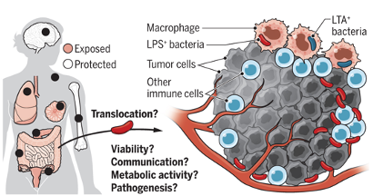

<!DOCTYPE html>
# Microbiome Harbored Within Tumors
<!--
	Photon by HTML5 UP
	html5up.net | @ajlkn
	Free for personal and commercial use under the CCA 3.0 license (html5up.net/license)
-->

<html lang="en">
  <head>
    <meta charset="utf-8">
    <meta name="viewport" content="width=device-width, initial-scale=1.0">
    <meta name="description" content="">
    <meta name="author" content="">
    <link rel="shortcut icon" href="assets/ico/favicon.png">

    <title>MINIMAL - Free Bootstrap 3 Theme</title>

    <!-- Bootstrap core CSS -->
    <link href="assets/css/bootstrap.css" rel="stylesheet">

    <!-- Custom styles for this template -->
    <link href="assets/css/main.css" rel="stylesheet">
	<link rel="stylesheet" href="assets/css/font-awesome.min.css">

    
	
	

	
    <link href='http://fonts.googleapis.com/css?family=Oswald:400,300,700' rel='stylesheet' type='text/css'>
    <link href='http://fonts.googleapis.com/css?family=EB+Garamond' rel='stylesheet' type='text/css'>

    <!-- HTML5 shim and Respond.js IE8 support of HTML5 elements and media queries -->
    <!--[if lt IE 9]>
      
      
    <![endif]-->
  </head>

  <body data-spy="scroll" data-offset="0" data-target="#theMenu">
		
	<!-- Menu -->
	<nav class="menu" id="theMenu">
		

			<h1 class="logo"><a href="index.html#home">Our platform</a></h1>
			<i class="icon-remove menu-close"></i>
			<a href="#home" class="smoothScroll">Introduction</a>
			<a href="#about" class="smoothScroll">Analysis documents</a>
			<a href="#Soft" class="smoothScroll">Analysis software</a>
			<a href="#contact" class="smoothScroll">Contact</a>
			<a href="#"><i class="icon-facebook"></i></a>
			<a href="#"><i class="icon-twitter"></i></a>
			<a href="#"><i class="icon-dribbble"></i></a>
			<a href="#"><i class="icon-envelope"></i></a>
		

		
		<!-- Menu button -->
		
<i class="icon-reorder"></i>

	</nav>

	<!-- ========== HEADER SECTION ========== -->
	<section id="home" name="home"></section>
	

		

			

				<h1>Introduction</h1>
				 
				<h3>Characterizing, visualizing and studying the effects that the bacteria inside tumors might have on different cancer hallmark </h3>
				 
				

				
			

				 
				

				

			

		

		<!-- /container -->
	

	
	<!-- /headerwrap -->
	
		<!-- Introduce -->
			<section id="one" class="main style1">
				

					

						

							<header class="major">
								<h2>We are currently studying various aspects of the tumor microbiome.</h2>
								<h3>Some examples include:</h3>
							</header>
							

							<a href="data/patient_seqInfo.csv">Characterization of the human tumor microbiome across additional tumor types</a> 
							<a href="data/HFDotus.tar.gz">The effect of the tumor (and gut) microbiome on resistance to cytotoxic, targeted and immune mediated anti-cancer therapies.</a> 
							<a href="data/HFDotus_nol.tar.gz">Characterization of the cross talk between bacteria and human cancer cells.</a> 
							<a href="data/HFDkos.tar.gz">Finding novel ways to manipulate the tumor/gut microbiome in order to affect different hallmarks of cancer.</a> 
							

						

						

							
						

					

				

			</section>

	<!-- Analysis -->
			<section id="one" class="main style2">
				

					

						

							<header class="major">
								<h2> Analysis Documents </h2>
							</header>
							

							<a href="analysis/HFD_process.html">Obtaining data</a> 
							<a href="analysis/Artificial_Neural_network.html">16S rRNA data processing</a> 
							<a href="analysis/HFD_diversity_nol.html">Metagenome data processing</a> 
							<a href="analysis/HFD_RFLODO.html">Machine Learning</a> 
							

						

						

							
						

					

				

			</section>

	<!-- Soft -->
			<section id="Soft" name="Soft"></section>
			<section id="one" class="main style2">
				

					

						

							<header class="major">
								<h2> Analysis software </h2>
							</header>
							

							<a href="analysis/HFD_process.html">R packages</a> 
							<a href="analysis/Artificial_Neural_network.html">Python</a> 
							<a href="analysis/HFD_diversity_nol.html">Online</a> 
							

						

						

							
						

					

				

			</section>

	<!-- ========== ABOUT SECTION ========== -->
	<section id="about" name="about"></section>
	

		

			

				<h3>ABOUT ME</h3>
				
<i class="icon icon-circle"></i><i class="icon icon-circle"></i><i class="icon icon-circle"></i>

				
				<!-- INTRO INFORMATIO-->
				

					
The development of novel therapies such as immune checkpoint inhibitors has resulted in dramatic improve­ ments in the outcomes of many patients with cancer. However, outcomes are heterogeneous, with some patients achieving dramatic durable complete remissions, and others deriving no benefit at all. Beyond tumour­ intrinsic features that might predict response and drive resistance, there is increasing evidence that host (ie, patient) factors, including the microbiota, might influence response to therapy.

					
we assess the evidence for the role of the microbiota in the therapeutic response of cancer, outline the determinants of the microbiota and potential strategies and considerations for microbiota modulation, as well as highlight the complexities with this approach, and a potential path forward for cancer treatment.

					
Sometimes I blog about design and web trends. Also I share links and my thoughts on <a href="http://twitter.com/BlackTie_co">Twitter</a>. Need a free handsome bootstrap theme? <a href="http://blacktie.co">Done!</a>

					
I'm available for freelance jobs. Contact me now.

					
<button type="button" class="btn btn-warning">The role of microbiota in carcinogenesis</button>

				
								
			

		
<!-- /container -->
	
<!-- /f -->
	

	<!-- ========== CAROUSEL SECTION ========== -->	
	<section id="portfolio" name="portfolio"></section>
	

		

			

				<h3>SOME PROJECTS</h3>
				
<i class="icon icon-circle"></i><i class="icon icon-circle"></i><i class="icon icon-circle"></i>

				
				

					

						<!-- Wrapper for slides -->
						

							

								
							

							

								
							

							

								
							

						

						 
						 
						<ol class="carousel-indicators">
						    <li data-target="#carousel-example-generic" data-slide-to="0" class="active"></li>
						    <li data-target="#carousel-example-generic" data-slide-to="1"></li>
						    <li data-target="#carousel-example-generic" data-slide-to="2"></li>
						</ol>
					

				
<!-- col-lg-8 -->
			
<!-- row -->
		
<!-- container -->
	
	<!-- f -->

	<!-- ========== CONTACT SECTION ========== -->
	<section id="contact" name="contact"></section>
	

		

			

				<h3>CONTACT ME</h3>
				
<i class="icon icon-circle"></i><i class="icon icon-circle"></i><i class="icon icon-circle"></i>

				
				

					
Sun Yat-sen University Cancer Center Guangzhou, China +86-20-87343795

					
zhaoxia1@sysucc.org.cn

					
<button type="button" class="btn btn-warning">YEAH! CONTACT ME NOW!</button>

				

			

		

	

	

    <!-- Bootstrap core JavaScript
    ================================================== -->
    <!-- Placed at the end of the document so the pages load faster -->
	
    
    
	
</body>
</html>
