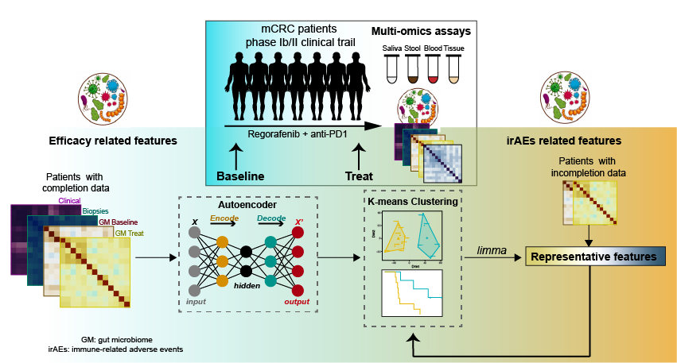

<!DOCTYPE html>

# Minoring the Clinical Outcome of Regorafenib/anti-PD1 Combination Treatment in mCRC Patients with Multi-omics assays

<!--
	Photon by HTML5 UP
	html5up.net | @ajlkn
	Free for personal and commercial use under the CCA 3.0 license (html5up.net/license)
-->

<html lang="en">
  <head>
    <meta charset="utf-8">
    <meta name="viewport" content="width=device-width, initial-scale=1.0">
    <meta name="description" content="">
    <meta name="author" content="">
    <link rel="shortcut icon" href="assets/ico/favicon.png">

    <title>MINIMAL - Free Bootstrap 3 Theme</title>

    <!-- Bootstrap core CSS -->
    <link href="assets/css/bootstrap.css" rel="stylesheet">

    <!-- Custom styles for this template -->
    <link href="assets/css/main.css" rel="stylesheet">
	<link rel="stylesheet" href="assets/css/font-awesome.min.css">

    
	
	

	
    <link href='http://fonts.googleapis.com/css?family=Oswald:400,300,700' rel='stylesheet' type='text/css'>
    <link href='http://fonts.googleapis.com/css?family=EB+Garamond' rel='stylesheet' type='text/css'>

    <!-- HTML5 shim and Respond.js IE8 support of HTML5 elements and media queries -->
    <!--[if lt IE 9]>
      
      
    <![endif]-->
  </head>

  <body data-spy="scroll" data-offset="0" data-target="#theMenu">
		
	<!-- Menu -->
	<nav class="menu" id="theMenu">
		

			<h1 class="logo"><a href="index.html#home">Muti-omics assays</a></h1>
			<i class="icon-remove menu-close"></i>
			<a href="#introduction" class="smoothScroll">Introduction</a>
			<a href="#data" class="smoothScroll">Data</a>
			<a href="#documents" class="smoothScroll">Documents</a>
			<a href="#software" class="smoothScroll">Software</a>
			<a href="#contact" class="smoothScroll">Contact</a>
		

		
		<!-- Menu button -->
		
<i class="icon-reorder"></i>

	</nav>
	
	<!-- ========== HEADER SECTION ========== -->
	<section id="introduction" name="home"></section>
	

		

			

			

			

				<h1>Introduction</h1>
				<h3>This is a phase Ib/II study of regorafenib plus toripalimab for metastatic colorectal cancer. 80mg regorafenib plus toripalimab was determined to be the maximum tolerated dose and recommended phase II dose (RP2D).</h3>
				
				 
				 
				

				

			

		
<!-- /container -->
	
<!-- /headerwrap -->
	
		<!-- Download -->
			<section id="data" class="main style1">
				

					

						

							<header class="major">
								<h2>Processed Data Downloads</h2>
							</header>
							

							<a href="data/patient_seqInfo.csv">Sequencing summary for multiomics</a> 
							<a href="data/HFDotus.tar.gz">meta</a> 
							<a href="data/HFDotus_nol.tar.gz">OTU tables</a> 
							<a href="data/HFDotus_nol.tar.gz">PublicData</a> 
							<a href="data/HFDkos.tar.gz">Supplymentary</a> 

							

						

						

							
						

					

				

			</section>

	<!-- Analysis -->
			<section id="documents" class="main style2">
				

					

						

							<header class="major">
								<h2> Analysis Documents </h2>
							</header>
							

							<a href="analysis/HFD_process.html">Samples an sequencing </a> 
							<a href="analysis/Artificial_Neural_network.html">Response related features</a> 
							<a href="analysis/HFD_diversity_nol.html">PFS related features</a> 
							<a href="analysis/HFD_RFLODO.html">irAEs related features</a> 
							<a href="analysis/HFD_features.html">Autoencoder for multiomics</a> 
							

						

						

							
						

					

				

			</section>

	
	<!-- ========== ABOUT SECTION ========== -->
	<section id="about" name="about"></section>
	

		

			

				<h3>ABOUT ME</h3>
				
<i class="icon icon-circle"></i><i class="icon icon-circle"></i><i class="icon icon-circle"></i>

				
				<!-- INTRO INFORMATIO-->
				

					
A full time theme crafter based in Madrid, Spain. I love designing beautiful, clean and user-friendly interfaces for websites.

					
My passion is turning good ideas and products into eye-catching sites.

					
Sometimes I blog about design and web trends. Also I share links and my thoughts on <a href="http://twitter.com/BlackTie_co">Twitter</a>. Need a free handsome bootstrap theme? <a href="http://blacktie.co">Done!</a>

					
I'm available for freelance jobs. Contact me now.

					
<button type="button" class="btn btn-warning">I HAVE A FREELANCE JOB</button>

				
								
			

		
<!-- /container -->
	
<!-- /f -->
	

	<!-- ========== CAROUSEL SECTION ========== -->	
	<section id="portfolio" name="portfolio"></section>
	

		

			

				<h3>SOME PROJECTS</h3>
				
<i class="icon icon-circle"></i><i class="icon icon-circle"></i><i class="icon icon-circle"></i>

				
				

					

						<!-- Wrapper for slides -->
						

							

								
							

							

								
							

							

								
							

						

						 
						 
						<ol class="carousel-indicators">
						    <li data-target="#carousel-example-generic" data-slide-to="0" class="active"></li>
						    <li data-target="#carousel-example-generic" data-slide-to="1"></li>
						    <li data-target="#carousel-example-generic" data-slide-to="2"></li>
						</ol>
					

				
<!-- col-lg-8 -->
			
<!-- row -->
		
<!-- container -->
	
	<!-- f -->

	<!-- ========== CONTACT SECTION ========== -->
	<section id="contact" name="contact"></section>
	

		

			

				<h3>CONTACT ME</h3>
				
<i class="icon icon-circle"></i><i class="icon icon-circle"></i><i class="icon icon-circle"></i>

				
				

					
Sun Yat-sen University Cancer Center Guangzhou, China +86-20-87343795

					
zhaoxia1@sysucc.org.cn

					
<button type="button" class="btn btn-warning">YEAH! CONTACT ME NOW!</button>

				

			

		

	

	

    <!-- Bootstrap core JavaScript
    ================================================== -->
    <!-- Placed at the end of the document so the pages load faster -->
	
    
    
	
</body>
</html>
